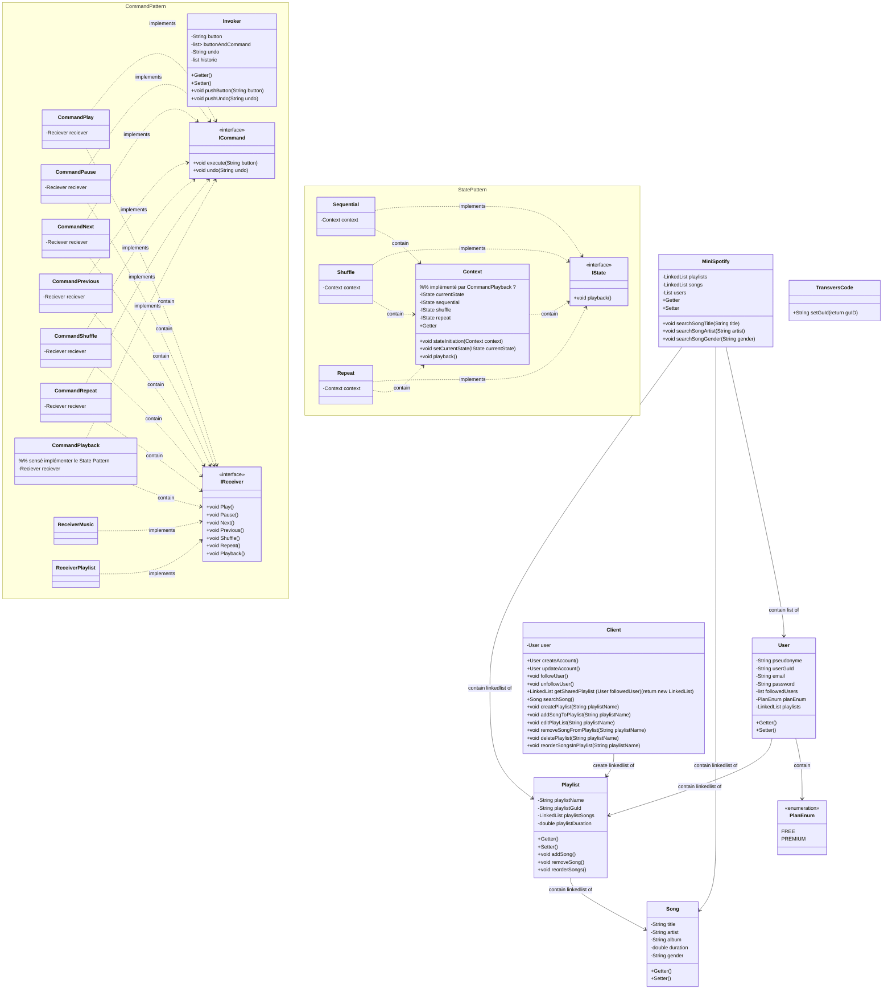

```mermaid

classDiagram
    
    class MiniSpotify{
        -LinkedList<Playlist> playlists
        -LinkedList<Song> songs
        -List<User> users
        +Getter
        +Setter
        +void searchSongTitle(String title)
        +void searchSongArtist(String artist)
        +void searchSongGender(String gender)
    }

    MiniSpotify --> Playlist : contain linkedlist of
    MiniSpotify --> Song : contain linkedlist of
    MiniSpotify --> User : contain list of

    class Client {
        -User user
        
        +User createAccount()
        +User updateAccount()
        +void followUser()
        +void unfollowUser()
        +LinkedList<Playlist> getSharedPlaylist (User followedUser)(return new LinkedList<Playlist>)
        +Song searchSong ()
        +void createPlaylist(String playlistName)
        +void addSongToPlaylist (String playlistName)
        +void editPlayList (String playlistName)
        +void removeSongFromPlaylist (String playlistName)
        +void deletePlaylist (String playlistName)
        +void reorderSongsInPlaylist (String playlistName)
    }
    Client --> Playlist : create linkedlist of
    class TransversCode{
        +String setGuId (return guID)
    }

    class PlanEnum{
        <<enumeration>>
        FREE
        PREMIUM
    }
    
    class User{
        -String pseudonyme
        -String userGuId
        -String email
        -String password
        -list<User> followedUsers
        -PlanEnum planEnum
        -LinkedList<Playlist> playlists
        +Getter()
        +Setter()
    }
    
    User --> Playlist : contain linkedlist of
    User -->PlanEnum : contain

    class Playlist {
        -String playlistName
        -String playlistGuId
        -LinkedList<Song> playlistSongs
        -double playlistDuration
        +Getter()
        +Setter()
        +void addSong()
        +void removeSong()
        +void reorderSongs()
    }
    
    Playlist --> Song : contain linkedlist of
    
    class Song {
        -String title
        -String artist
        -String album
        -double duration
        -String gender
        +Getter()
        +Setter()
    }
    
    namespace CommandPattern {
        class Invoker{
            -String button
            -list<Map<String,Command>> buttonAndCommand
            -String undo
            -list<String> historic
            +Getter()
            +Setter()         
            +void pushButton(String button)
            +void pushUndo(String undo)
        }

        class IReceiver{
            <<interface>>
            +void Play()
            +void Pause()
            +void Next()
            +void Previous()
            +void Shuffle()
            +void Repeat()
            +void Playback()
        }
        
        class ReceiverMusic{ }
        
        class ReceiverPlaylist{ }

        class ICommand {
            <<interface>>
            +void execute(String button)
            +void undo(String undo)
        }
        
        class CommandPlay{
            -Reciever reciever
        }
        class CommandPause{
            -Reciever reciever
        }
        class CommandNext{
            -Reciever reciever
        }
        class CommandPrevious{
            -Reciever reciever
        }
        class CommandShuffle{
            -Reciever reciever
        }
        class CommandRepeat{
            -Reciever reciever
        }
        class CommandPlayback{ %% sensé implémenter le State Pattern
            -Reciever reciever
        }
    }

%% Command Pattern links
    CommandPlay ..> ICommand : implements
    CommandPlay ..> IReceiver : contain
    CommandPause ..> ICommand : implements
    CommandPause ..> IReceiver : contain
    CommandNext ..> ICommand : implements
    CommandNext ..> IReceiver : contain
    CommandPrevious ..> ICommand : implements
    CommandPrevious ..> IReceiver : contain
    CommandShuffle ..> ICommand : implements
    CommandShuffle ..> IReceiver : contain
    CommandRepeat ..> ICommand : implements
    CommandRepeat ..> IReceiver : contain
    CommandPlayback ..> ICommand : implements
    CommandPlayback ..> IReceiver : contain
    ReceiverMusic ..> IReceiver : implements
    ReceiverPlaylist ..> IReceiver : implements
    
    namespace State Pattern {
        
        class IState {
            <<interface>>
            +void playback()
        }
        class Sequential{
            -Context context
        }
        class Shuffle{
            -Context context
        }
        class Repeat{
            -Context context
        }
        class Context { %% implémenté par CommandPlayback ?
            -IState currentState
            -IState sequential
            -IState shuffle
            -IState repeat
            +void stateInitiation (Context context)
            +void setCurrentState(IState currentState)
            +void playback()
            +Getter
        }        
    }

    Sequential ..> IState : implements
    Sequential ..> Context : contain
    Shuffle ..> IState : implements
    Shuffle ..> Context : contain
    Repeat ..> IState : implements
    Repeat ..> Context : contain
    Context ..> IState : contain
    
```

