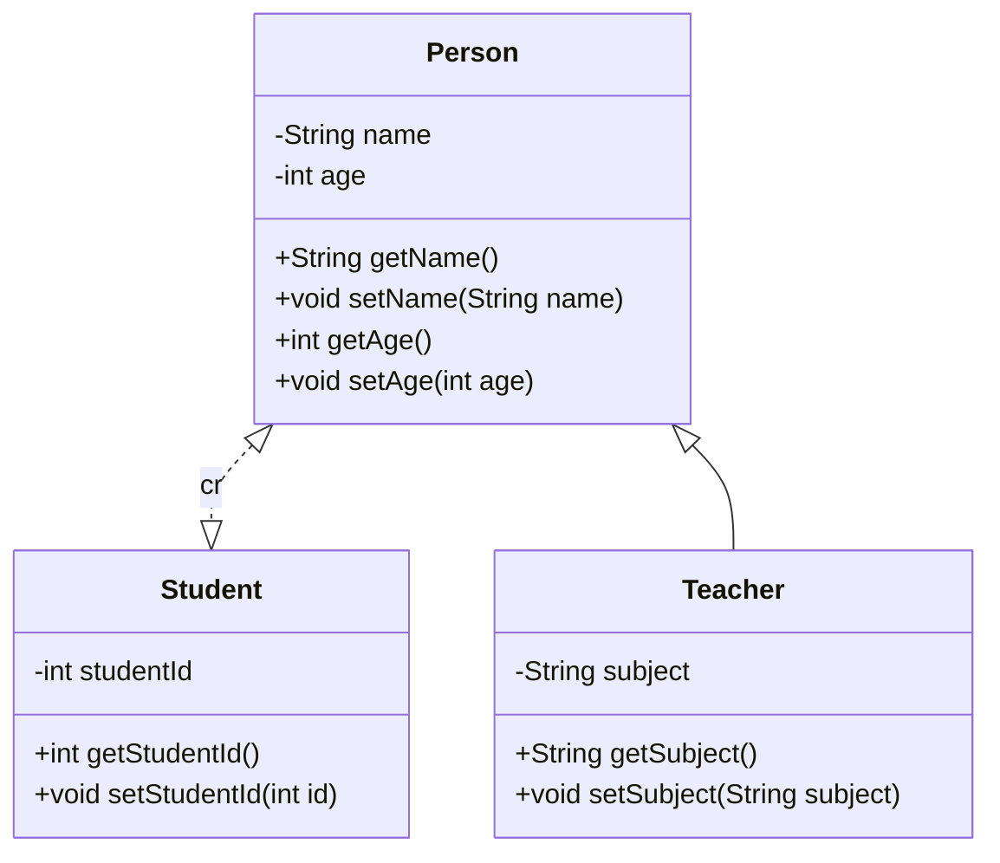

```mermaid

classDiagram
    class Person {
        -String name
        -int age
        +String getName()
        +void setName(String name)
        +int getAge()
        +void setAge(int age)
    }

    class Student {
        -int studentId
        +int getStudentId()
        +void setStudentId(int id)
    }

    class Teacher {
        -String subject
        +String getSubject()
        +void setSubject(String subject)
    }

    Person <|..|> Student : cr
    Person <|-- Teacher
```